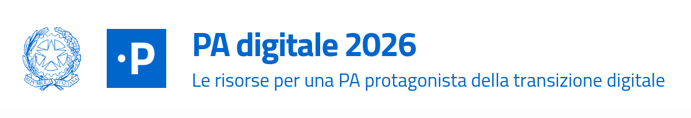

<div align="center">
   
</div>

# PA Digitale 2026

Questo è il repository del progetto PA Digitale 2026, un'applicazione web sviluppata con Next.js e un set completo di strumenti moderni per il frontend.

[↪ English version](README-en.md)

## Argomenti

- [↪ Convenzioni coding](doc/CODING.md)
- [↪ Procedura di rilascio](doc/RELEASE.md)
- [↪ Documentazione componenti](doc/COMPONENTS.md)
- [↪ Creare redirects](doc/REDIRECTS.md)

## Tecnologie Principali

- [🌐 Next.js](https://nextjs.org/) - Framework React per la produzione
- [🌐 DatoCMS](https://www.datocms.com/) - Headless CMS per la gestione dei contenuti
- [🌐 Bootstrap Italia](https://italia.github.io/bootstrap-italia/) - Libreria di componenti UI per la PA
- [🌐 Design React Kit](https://italia.github.io/design-react-kit/) - Componenti React del Design System della PA
- [🌐 Bun](https://bun.sh/) - Runtime JavaScript e gestore pacchetti

## Prerequisiti

- [🌐 Bun](https://bun.sh/) (raccomandato)
- Node.js 18+ (alternativa)

## Installazione

1. Clona il repository:

```bash
git clone [url-repository]
cd padigitale2026.gov.it
```

2. Installa le dipendenze:

```bash
bun install
```

3. Configura le variabili d'ambiente:
   - Copia il file `.env.dist` in `.env`
   - Compila le variabili d'ambiente necessarie nel file `.env`

## Sviluppo Locale

Per avviare il server di sviluppo con Bun (consigliato):

```bash
bun --bun run dev
```

Per utilizzare Node.js invece di Bun:

```bash
bun run dev
```

L'applicazione sarà disponibile all'indirizzo [↪ http://localhost:3000](http://localhost:3000).

## Build e Produzione

Per costruire l'applicazione per la produzione:

```bash
bun run build
```

Per avviare il server in modalità produzione:

```bash
bun run start
```

## Altri Comandi Utili

- `bun run lint` - Esegue il linting del codice
- `bun run codegen` - Genera i tipi GraphQL

## Configurazione

Il progetto richiede diverse variabili d'ambiente per funzionare correttamente. Un template delle variabili necessarie è disponibile nel file `.env.dist`. È necessario creare un file `.env` locale con i valori appropriati per:

- Configurazione DatoCMS
- Redis
- Vercel/Next.js
- Algolia
- Salesforce
- Altri servizi integrati

## Contribuire

Per contribuire al progetto, assicurati di:

1. Creare un branch per le tue modifiche
2. Seguire le [↪ convenzioni di codice del progetto](doc/CODING.md)
3. Testare le modifiche localmente
4. Inviare una [↪ pull request](doc/RELEASE.md) (PR) con una descrizione dettagliata delle modifiche
